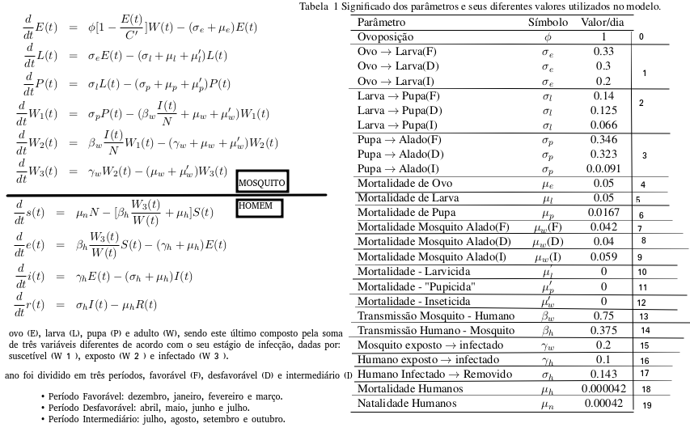

# DenguePropagation
Analise de propagação da doença Dengue através do método de Runge-Kuta auxiliado por um método explícito

Neste trabalho abordamos apenas as equações relativas a população de mosquitos. 
<p align="center">

</p>

As variáveis de inicialização são:
```
##############################
#Inicializacao das variaveis#
##############################

#Valores iniciais
dias = 7200 # por quantos dias deseja executar a simulação
h = 0.19    


iteracoes = int(dias/h )


t = 0 
x = (1 *h)/0.04

Essas são exatamente as equações do mosquito da figura acima
#### Mosquito ####
Et = 225.0
Lt = 15.0
Pt = 50.0
W1t = 5.0
W2t = 20.0
W3t = 100.0

# Wt = W1t + W2t + W3t

### Humanos ###
St = 2.0
et = 5.0
It = 30.0 
Rt = 4.0


#Y0 = [float(Et), float(Lt), float(Pt), float(W1t), float(W2t), float(W3t), float(St),float(et), float(It), float(Rt)]
Y0 = [float(Et), float(Lt), float(Pt), float(W1t), float(W2t), float(W3t)]


Cfixo = 700.0     #Valor referente ao periodo favoravel   || Cfixo = 500 -> Intermediário || Cfico = 300 -> desfavorável
Ci = 0.5       #Valor do teorema do chute
Clinha = Ci * Cfixo     #capacidade de suporte ambiental
```
